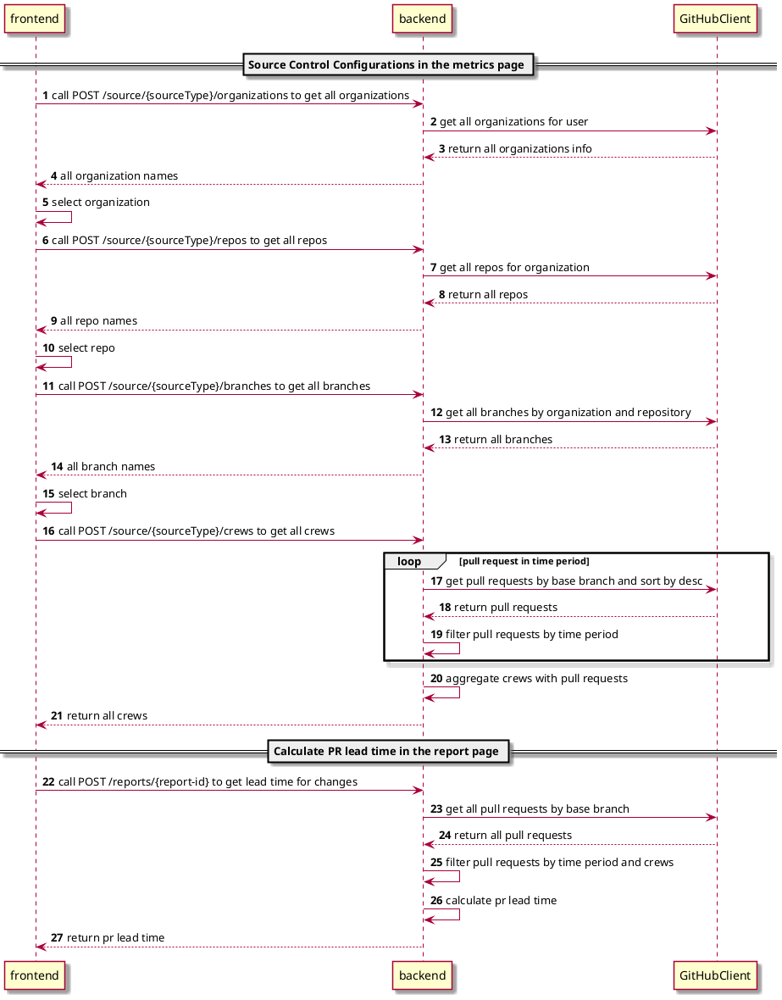

## Background

Currently, for some users who do not use buildKite deployment, we will migrate some data originally obtained from buildKite to GitHub, so we need to understand the relevant API of GitHub.

## Expect

We want to use the GitHub API to retrieve the key information we need. With the data obtained this way, we can calculate pr lead time.

## Design

### Solution

#### Sequence Diagram



#### API

#### 1. Get all organizations

##### 1.1. API

  ```shell
  POST /source-control/{sourceType}/organizations
  ```

##### 1.2. Request body

  ```json
  {
    "token": "GitHub token"
  }
  ```

##### 1.3. Response status code

| Status code | 	Description            |
|-------------|-------------------------|
| 200         | OK                      |
| 401         | Requires authentication |
| 403         | Forbidden               |

##### 1.4. Response body

  ```json
  {
    "name": ["organization name"]
  }
  ```

#### 2. Get all repositories

##### 2.1. API

  ```shell
  POST /source-control/{sourceType}/repos
  ```

##### 2.2. Request body

  ```json
  {
    "token": "GitHub token",
    "organization": "organization name"
  }
  ```

##### 2.3. Response status code

| Status code | 	Description            |
|-------------|-------------------------|
| 200         | OK                      |
| 401         | Requires authentication |
| 403         | Forbidden               |

##### 2.4. Response body

  ```json
  {
    "name": ["repo name"]
  }
  ```

#### 3. Get all branches

##### 3.1. API

  ```shell
  POST /source-control/{sourceType}/branches
  ```

##### 3.2. Request body

  ```json
  {
    "token": "GitHub token",
    "organization": "organization name",
    "repo": "repo name"
  }
  ```

##### 3.3. Response status code

| Status code | 	Description            |
|-------------|-------------------------|
| 200         | OK                      |
| 401         | Requires authentication |
| 403         | Forbidden               |


##### 3.4. Response body

  ```json
  {
    "name": ["branch name"]
  }
  ```

#### 4. Get all crews

##### 4.1. API

  ```shell
  POST /source-control/{sourceType}/crews
  ```

##### 4.2. Request body

  ```json
  {
    "token": "GitHub token",
    "organization": "organization name",
    "repo": "repo name",
    "branch": "branch name",
    "startTime": "1717171200000",
    "endTime": "1717171200000"
  }
  ```

##### 4.3. Response status code

| Status code | 	Description            |
|-------------|-------------------------|
| 200         | OK                      |
| 401         | Requires authentication |
| 403         | Forbidden               |

##### 4.4. Response body

  ```json
    {
      "crews": ["zhou-yinyuan"]
    }
  ```

#### 5. Report API

##### 1. Modify

- For report API `POST /reports/{report-id}`, modify the request body, and add below key-value:

  ```json
  {
    ...
    "codebaseSetting": {
      ...
      "pipelineCrews": ["zhou-yinyuan"], // new added
      "codebases": [ // new added
        {
          "branches": ["branch name"],
          "repo": "repo name",
          "organization": "organization name"
        }
      ]
    }
  }
  ```

### GitHub API

#### 1. Get all organizations for user

##### 1.1 API
   ```shell
   curl -L \
   -H "Accept: application/vnd.github+json" \
   -H "Authorization: Bearer <YOUR-TOKEN>" \
   -H "X-GitHub-Api-Version: 2022-11-28" \
   https://api.github.com/user/orgs
   ```

##### 1.2 Query parameters
  - `per_page`:
    - integer
    - The number of results per page (max 100)
    - Default: 30
  - `page`:
    - integer
    - The page number of the results to fetch.
    - Default: 1

##### 1.3 Request header
  - `accept`
    - Setting to `application/vnd.github+json` is recommended.

##### 1.4 HTTP response status codes

| Status code | 	Description            |
|-------------|-------------------------|
| 200         | OK                      |
| 304         | Not modified            |
| 401         | Requires authentication |
| 403         | Forbidden               |

##### 1.5 Response example:

  ```json
  [
    {
      "login": "au-heartbeat",
      "id": 110084685,
      "node_id": "O_kgDOBo_CTQ",
      "url": "https://api.github.com/orgs/au-heartbeat",
      "repos_url": "https://api.github.com/orgs/au-heartbeat/repos",
      "events_url": "https://api.github.com/orgs/au-heartbeat/events",
      "hooks_url": "https://api.github.com/orgs/au-heartbeat/hooks",
      "issues_url": "https://api.github.com/orgs/au-heartbeat/issues",
      "members_url": "https://api.github.com/orgs/au-heartbeat/members{/member}",
      "public_members_url": "https://api.github.com/orgs/au-heartbeat/public_members{/member}",
      "avatar_url": "https://avatars.githubusercontent.com/u/110084685?v=4",
      "description": null
    }
  ]
  ```

##### 1.6 More Info
  - [More info](https://docs.github.com/en/rest/orgs/orgs?apiVersion=2022-11-28#list-organizations-for-the-authenticated-user)

#### 2. Get all repos for organization

##### 2.1 API

   ```shell
   curl -L \
  -H "Accept: application/vnd.github+json" \
  -H "Authorization: Bearer <YOUR-TOKEN>" \
  -H "X-GitHub-Api-Version: 2022-11-28" \
  https://api.github.com/orgs/<ORG>/repos
   ```

##### 2.2 Path parameters
  - `org`:
    - Required
    - string
    - The organization name. The name is not case sensitive.

##### 2.3 Request header
  - `accept`
    - Setting to `application/vnd.github+json` is recommended.

##### 2.4 Query parameters
  - `type`
    - string
    - Specifies the types of repositories you want returned.
    - Can be one of: `all`, `public`, `private`, `forks`, `sources`, `member`
    - Default: `all`
  - `sort`
    - string
    - The property to sort the results by.
    - Can be one of: `created`, `updated`, `pushed`, `full_name`
    - Default: `created`
  - `direction`
    - string
    - The order to sort by
    - Can be one of: `asc`, `desc`
    - Default: `asc` when using `full_name`, otherwise `desc`.
  - `per_page`:
    - integer
    - The number of results per page (max 100)
    - Default: 30
- `page`:
  - integer
  - The page number of the results to fetch.
  - Default: 1

##### 2.5 HTTP response status codes

| Status code | 	Description            |
|-------------|-------------------------|
| 200         | OK                      |
| 401         | Requires authentication |

##### 2.6 Response example:

  ```json
  [
    {
      "id": 517512988,
      "node_id": "R_kgDOHtifHA",
      "name": "Heartbeat",
      "full_name": "au-heartbeat/Heartbeat",
      "private": false,
      "owner": {
        "login": "au-heartbeat",
        "id": 110084685,
        "node_id": "O_kgDOBo_CTQ",
        "avatar_url": "https://avatars.githubusercontent.com/u/110084685?v=4",
        "gravatar_id": "",
        "url": "https://api.github.com/users/au-heartbeat",
        "html_url": "https://github.com/au-heartbeat",
        "followers_url": "https://api.github.com/users/au-heartbeat/followers",
        "following_url": "https://api.github.com/users/au-heartbeat/following{/other_user}",
        "gists_url": "https://api.github.com/users/au-heartbeat/gists{/gist_id}",
        "starred_url": "https://api.github.com/users/au-heartbeat/starred{/owner}{/repo}",
        "subscriptions_url": "https://api.github.com/users/au-heartbeat/subscriptions",
        "organizations_url": "https://api.github.com/users/au-heartbeat/orgs",
        "repos_url": "https://api.github.com/users/au-heartbeat/repos",
        "events_url": "https://api.github.com/users/au-heartbeat/events{/privacy}",
        "received_events_url": "https://api.github.com/users/au-heartbeat/received_events",
        "type": "Organization",
        "site_admin": false
      },
      "html_url": "https://github.com/au-heartbeat/Heartbeat",
      "description": "Heartbeat is a tool for tracking project delivery metrics that can help you get a better understanding of delivery performance. This product allows you easily get all aspects of source data faster and more accurate to analyze team delivery performance which enables delivery teams and team leaders focusing on driving continuous improvement and enhan",
      "fork": true,
      "url": "https://api.github.com/repos/au-heartbeat/Heartbeat",
      "forks_url": "https://api.github.com/repos/au-heartbeat/Heartbeat/forks",
      "keys_url": "https://api.github.com/repos/au-heartbeat/Heartbeat/keys{/key_id}",
      "collaborators_url": "https://api.github.com/repos/au-heartbeat/Heartbeat/collaborators{/collaborator}",
      "teams_url": "https://api.github.com/repos/au-heartbeat/Heartbeat/teams",
      "hooks_url": "https://api.github.com/repos/au-heartbeat/Heartbeat/hooks",
      "issue_events_url": "https://api.github.com/repos/au-heartbeat/Heartbeat/issues/events{/number}",
      "events_url": "https://api.github.com/repos/au-heartbeat/Heartbeat/events",
      "assignees_url": "https://api.github.com/repos/au-heartbeat/Heartbeat/assignees{/user}",
      "branches_url": "https://api.github.com/repos/au-heartbeat/Heartbeat/branches{/branch}",
      "tags_url": "https://api.github.com/repos/au-heartbeat/Heartbeat/tags",
      "blobs_url": "https://api.github.com/repos/au-heartbeat/Heartbeat/git/blobs{/sha}",
      "git_tags_url": "https://api.github.com/repos/au-heartbeat/Heartbeat/git/tags{/sha}",
      "git_refs_url": "https://api.github.com/repos/au-heartbeat/Heartbeat/git/refs{/sha}",
      "trees_url": "https://api.github.com/repos/au-heartbeat/Heartbeat/git/trees{/sha}",
      "statuses_url": "https://api.github.com/repos/au-heartbeat/Heartbeat/statuses/{sha}",
      "languages_url": "https://api.github.com/repos/au-heartbeat/Heartbeat/languages",
      "stargazers_url": "https://api.github.com/repos/au-heartbeat/Heartbeat/stargazers",
      "contributors_url": "https://api.github.com/repos/au-heartbeat/Heartbeat/contributors",
      "subscribers_url": "https://api.github.com/repos/au-heartbeat/Heartbeat/subscribers",
      "subscription_url": "https://api.github.com/repos/au-heartbeat/Heartbeat/subscription",
      "commits_url": "https://api.github.com/repos/au-heartbeat/Heartbeat/commits{/sha}",
      "git_commits_url": "https://api.github.com/repos/au-heartbeat/Heartbeat/git/commits{/sha}",
      "comments_url": "https://api.github.com/repos/au-heartbeat/Heartbeat/comments{/number}",
      "issue_comment_url": "https://api.github.com/repos/au-heartbeat/Heartbeat/issues/comments{/number}",
      "contents_url": "https://api.github.com/repos/au-heartbeat/Heartbeat/contents/{+path}",
      "compare_url": "https://api.github.com/repos/au-heartbeat/Heartbeat/compare/{base}...{head}",
      "merges_url": "https://api.github.com/repos/au-heartbeat/Heartbeat/merges",
      "archive_url": "https://api.github.com/repos/au-heartbeat/Heartbeat/{archive_format}{/ref}",
      "downloads_url": "https://api.github.com/repos/au-heartbeat/Heartbeat/downloads",
      "issues_url": "https://api.github.com/repos/au-heartbeat/Heartbeat/issues{/number}",
      "pulls_url": "https://api.github.com/repos/au-heartbeat/Heartbeat/pulls{/number}",
      "milestones_url": "https://api.github.com/repos/au-heartbeat/Heartbeat/milestones{/number}",
      "notifications_url": "https://api.github.com/repos/au-heartbeat/Heartbeat/notifications{?since,all,participating}",
      "labels_url": "https://api.github.com/repos/au-heartbeat/Heartbeat/labels{/name}",
      "releases_url": "https://api.github.com/repos/au-heartbeat/Heartbeat/releases{/id}",
      "deployments_url": "https://api.github.com/repos/au-heartbeat/Heartbeat/deployments",
      "created_at": "2022-07-25T04:10:33Z",
      "updated_at": "2024-08-20T09:34:35Z",
      "pushed_at": "2024-08-20T09:35:58Z",
      "git_url": "git://github.com/au-heartbeat/Heartbeat.git",
      "ssh_url": "git@github.com:au-heartbeat/Heartbeat.git",
      "clone_url": "https://github.com/au-heartbeat/Heartbeat.git",
      "svn_url": "https://github.com/au-heartbeat/Heartbeat",
      "homepage": "https://au-heartbeat.github.io/Heartbeat/",
      "size": 94466,
      "stargazers_count": 9,
      "watchers_count": 9,
      "language": "TypeScript",
      "has_issues": true,
      "has_projects": true,
      "has_downloads": true,
      "has_wiki": true,
      "has_pages": true,
      "has_discussions": false,
      "forks_count": 15,
      "mirror_url": null,
      "archived": false,
      "disabled": false,
      "open_issues_count": 6,
      "license": {
        "key": "mit",
        "name": "MIT License",
        "spdx_id": "MIT",
        "url": "https://api.github.com/licenses/mit",
        "node_id": "MDc6TGljZW5zZTEz"
      },
      "allow_forking": true,
      "is_template": false,
      "web_commit_signoff_required": false,
      "topics": [
        "doro",
        "metrics"
      ],
      "visibility": "public",
      "forks": 15,
      "open_issues": 6,
      "watchers": 9,
      "default_branch": "main",
      "permissions": {
        "admin": true,
        "maintain": true,
        "push": true,
        "triage": true,
        "pull": true
      }
    }
  ]
  ```

##### 2.7 More Info
- [More info](https://docs.github.com/en/rest/repos/repos?apiVersion=2022-11-28#list-organization-repositories)

#### 3. Get all branches by organization and repository

##### 3.1 API

   ```shell
   curl -L \
  -H "Accept: application/vnd.github+json" \
  -H "Authorization: Bearer <YOUR-TOKEN>" \
  -H "X-GitHub-Api-Version: 2022-11-28" \
  https://api.github.com/repos/<OWNER>/<REPO>/branches
   ```

##### 3.2 Path parameters
  - `owner`:
    - Required
    - string
    - The account owner of the repository. The name is not case sensitive.
  - `repo`:
    - Required
    - string
    - The name of the repository without the .git extension. The name is not case sensitive.

##### 3.3 Request header
- `accept`
  - Setting to `application/vnd.github+json` is recommended.

##### 3.4 Query parameters
- `protected`
  - boolean
  - Setting to true returns only branches protected by branch protections or rulesets. When set to false, only unprotected branches are returned. Omitting this parameter returns all branches.
- `per_page`:
  - integer
  - The number of results per page (max 100)
  - Default: 30
- `page`:
  - integer
  - The page number of the results to fetch.
  - Default: 1

##### 3.5 HTTP response status codes

| Status code | 	Description            |
|-------------|-------------------------|
| 200         | OK                      |
| 401         | Requires authentication |
| 404         | Resource not found      |

##### 3.6 Response example:

  ```json
  [
    {
      "name": "main",
      "commit": {
        "sha": "ae0681ac851c520c5aa95c86d04a628ab8afd2b6",
        "url": "https://api.github.com/repos/au-heartbeat/Heartbeat/commits/ae0681ac851c520c5aa95c86d04a628ab8afd2b6"
      },
      "protected": true,
      "protection": {
        "enabled": true,
        "required_status_checks": {
          "enforcement_level": "non_admins",
          "contexts": [
            "backend-check",
            "backend-license-check",
            "frontend-check",
            "frontend-license-check",
            "security-check",
            "buildkite/heartbeat",
            "[au-heartbeat-heartbeat-frontend] SonarCloud Code Analysis",
            "[heartbeat-backend] SonarCloud Code Analysis"
          ],
          "checks": [
            {
              "context": "backend-check",
              "app_id": 15368
            },
            {
              "context": "backend-license-check",
              "app_id": 15368
            },
            {
              "context": "frontend-check",
              "app_id": 15368
            },
            {
              "context": "frontend-license-check",
              "app_id": 15368
            },
            {
              "context": "security-check",
              "app_id": 15368
            },
            {
              "context": "buildkite/heartbeat",
              "app_id": 72
            },
            {
              "context": "[au-heartbeat-heartbeat-frontend] SonarCloud Code Analysis",
              "app_id": 12526
            },
            {
              "context": "[heartbeat-backend] SonarCloud Code Analysis",
              "app_id": 12526
            }
          ]
        }
      },
      "protection_url": "https://api.github.com/repos/au-heartbeat/Heartbeat/branches/main/protection"
    }
  ]
  ```

##### 3.7 More Info
- [More info](https://docs.github.com/en/rest/branches/branches?apiVersion=2022-11-28#list-branches)

#### 4. Get all pull requests by base branch

##### 4.1 API

   ```shell
   curl -L \
  -H "Accept: application/vnd.github+json" \
  -H "Authorization: Bearer <YOUR-TOKEN>" \
  -H "X-GitHub-Api-Version: 2022-11-28" \
  https://api.github.com/repos/<OWNER>/<REPO>/pulls
   ```

##### 4.2 Path parameters
  - `owner`:
    - Required
    - string
    - The account owner of the repository. The name is not case sensitive.
  - `repo`:
    - Required
    - string
    - The name of the repository without the .git extension. The name is not case sensitive.

##### 4.3 Request header
  - `accept`
    - Setting to `application/vnd.github+json` is recommended.

##### 4.4 Query parameters
  - `state`
    - string
    - Either `open`, `closed`, or `all` to filter by state.
    - Default: `open`
    - Can be one of: `open`, `closed`, `all`
  - `head`
    - string
    - Filter pulls by head user or head organization and branch name in the format of `user:ref-name` or `organization:ref-name`.
    - For example: `github:new-script-format` or `octocat:test-branch`.
  - `base`
    - string
    - Filter pulls by base branch name.
    - Example: `main`
  - `per_page`:
    - integer
    - The number of results per page (max 100)
    - Default: 30
  - `page`:
    - integer
    - The page number of the results to fetch.
    - Default: 1
  - `sort`:
    - string
    - What to sort results by. popularity will sort by the number of comments. long-running will sort by date created and will limit the results to pull requests that have been open for more than a month and have had activity within the past month.
    - Default: `created`
    - Can be one of: `created`, `updated`, `popularity`, `long-running`
  - `direction`:
    - string
    - The direction of the sort.
    - Default: `desc` when sort is created or sort is not specified, otherwise `asc`.
    - Can be one of: `asc`, `desc`

##### 4.5 HTTP response status codes

| Status code | 	Description            |
|-------------|-------------------------|
| 200         | OK                      |
| 304         | Not modified            |
| 401         | Requires authentication |
| 404         | Resource not found      |

##### 4.6 Response example:

  ```json
  [
    {
      "url": "https://api.github.com/repos/au-heartbeat/Heartbeat/pulls/1582",
      "id": 2026687212,
      "node_id": "PR_kwDOHtifHM54zMrs",
      "html_url": "https://github.com/au-heartbeat/Heartbeat/pull/1582",
      "diff_url": "https://github.com/au-heartbeat/Heartbeat/pull/1582.diff",
      "patch_url": "https://github.com/au-heartbeat/Heartbeat/pull/1582.patch",
      "issue_url": "https://api.github.com/repos/au-heartbeat/Heartbeat/issues/1582",
      "number": 1582,
      "state": "closed",
      "locked": false,
      "title": "ADM-998 [frontend][backend]: add none option when dora metric select only lead time for changes",
      "user": {
        "login": "zhou-yinyuan",
        "id": 147299494,
        "node_id": "U_kgDOCMecpg",
        "avatar_url": "https://avatars.githubusercontent.com/u/147299494?v=4",
        "gravatar_id": "",
        "url": "https://api.github.com/users/zhou-yinyuan",
        "html_url": "https://github.com/zhou-yinyuan",
        "followers_url": "https://api.github.com/users/zhou-yinyuan/followers",
        "following_url": "https://api.github.com/users/zhou-yinyuan/following{/other_user}",
        "gists_url": "https://api.github.com/users/zhou-yinyuan/gists{/gist_id}",
        "starred_url": "https://api.github.com/users/zhou-yinyuan/starred{/owner}{/repo}",
        "subscriptions_url": "https://api.github.com/users/zhou-yinyuan/subscriptions",
        "organizations_url": "https://api.github.com/users/zhou-yinyuan/orgs",
        "repos_url": "https://api.github.com/users/zhou-yinyuan/repos",
        "events_url": "https://api.github.com/users/zhou-yinyuan/events{/privacy}",
        "received_events_url": "https://api.github.com/users/zhou-yinyuan/received_events",
        "type": "User",
        "site_admin": false
      },
      "body": "## Summary\r\n\r\n...\r\n\r\n## Before\r\n\r\n_Description_\r\n\r\n**Screenshots**\r\nIf applicable, add screenshots to help explain behavior of your code.\r\n\r\n## After\r\n\r\n_Description_\r\n\r\n**Screenshots**\r\nIf applicable, add screenshots to help explain behavior of your code.\r\n\r\n## Note\r\n\r\n_Null_\r\n",
      "created_at": "2024-08-20T01:59:41Z",
      "updated_at": "2024-08-20T09:34:33Z",
      "closed_at": "2024-08-20T09:34:31Z",
      "merged_at": "2024-08-20T09:34:31Z",
      "merge_commit_sha": "ae0681ac851c520c5aa95c86d04a628ab8afd2b6",
      "assignee": null,
      "assignees": [],
      "requested_reviewers": [],
      "requested_teams": [],
      "labels": [],
      "milestone": null,
      "draft": false,
      "commits_url": "https://api.github.com/repos/au-heartbeat/Heartbeat/pulls/1582/commits",
      "review_comments_url": "https://api.github.com/repos/au-heartbeat/Heartbeat/pulls/1582/comments",
      "review_comment_url": "https://api.github.com/repos/au-heartbeat/Heartbeat/pulls/comments{/number}",
      "comments_url": "https://api.github.com/repos/au-heartbeat/Heartbeat/issues/1582/comments",
      "statuses_url": "https://api.github.com/repos/au-heartbeat/Heartbeat/statuses/e4317e6b4b41633fb23766a04da04f05001e1a79",
      "head": {
        "label": "au-heartbeat:ADM-998",
        "ref": "ADM-998",
        "sha": "e4317e6b4b41633fb23766a04da04f05001e1a79",
        "user": {
          "login": "au-heartbeat",
          "id": 110084685,
          "node_id": "O_kgDOBo_CTQ",
          "avatar_url": "https://avatars.githubusercontent.com/u/110084685?v=4",
          "gravatar_id": "",
          "url": "https://api.github.com/users/au-heartbeat",
          "html_url": "https://github.com/au-heartbeat",
          "followers_url": "https://api.github.com/users/au-heartbeat/followers",
          "following_url": "https://api.github.com/users/au-heartbeat/following{/other_user}",
          "gists_url": "https://api.github.com/users/au-heartbeat/gists{/gist_id}",
          "starred_url": "https://api.github.com/users/au-heartbeat/starred{/owner}{/repo}",
          "subscriptions_url": "https://api.github.com/users/au-heartbeat/subscriptions",
          "organizations_url": "https://api.github.com/users/au-heartbeat/orgs",
          "repos_url": "https://api.github.com/users/au-heartbeat/repos",
          "events_url": "https://api.github.com/users/au-heartbeat/events{/privacy}",
          "received_events_url": "https://api.github.com/users/au-heartbeat/received_events",
          "type": "Organization",
          "site_admin": false
        },
        "repo": {
          "id": 517512988,
          "node_id": "R_kgDOHtifHA",
          "name": "Heartbeat",
          "full_name": "au-heartbeat/Heartbeat",
          "private": false,
          "owner": {
            "login": "au-heartbeat",
            "id": 110084685,
            "node_id": "O_kgDOBo_CTQ",
            "avatar_url": "https://avatars.githubusercontent.com/u/110084685?v=4",
            "gravatar_id": "",
            "url": "https://api.github.com/users/au-heartbeat",
            "html_url": "https://github.com/au-heartbeat",
            "followers_url": "https://api.github.com/users/au-heartbeat/followers",
            "following_url": "https://api.github.com/users/au-heartbeat/following{/other_user}",
            "gists_url": "https://api.github.com/users/au-heartbeat/gists{/gist_id}",
            "starred_url": "https://api.github.com/users/au-heartbeat/starred{/owner}{/repo}",
            "subscriptions_url": "https://api.github.com/users/au-heartbeat/subscriptions",
            "organizations_url": "https://api.github.com/users/au-heartbeat/orgs",
            "repos_url": "https://api.github.com/users/au-heartbeat/repos",
            "events_url": "https://api.github.com/users/au-heartbeat/events{/privacy}",
            "received_events_url": "https://api.github.com/users/au-heartbeat/received_events",
            "type": "Organization",
            "site_admin": false
          },
          "html_url": "https://github.com/au-heartbeat/Heartbeat",
          "description": "Heartbeat is a tool for tracking project delivery metrics that can help you get a better understanding of delivery performance. This product allows you easily get all aspects of source data faster and more accurate to analyze team delivery performance which enables delivery teams and team leaders focusing on driving continuous improvement and enhan",
          "fork": true,
          "url": "https://api.github.com/repos/au-heartbeat/Heartbeat",
          "forks_url": "https://api.github.com/repos/au-heartbeat/Heartbeat/forks",
          "keys_url": "https://api.github.com/repos/au-heartbeat/Heartbeat/keys{/key_id}",
          "collaborators_url": "https://api.github.com/repos/au-heartbeat/Heartbeat/collaborators{/collaborator}",
          "teams_url": "https://api.github.com/repos/au-heartbeat/Heartbeat/teams",
          "hooks_url": "https://api.github.com/repos/au-heartbeat/Heartbeat/hooks",
          "issue_events_url": "https://api.github.com/repos/au-heartbeat/Heartbeat/issues/events{/number}",
          "events_url": "https://api.github.com/repos/au-heartbeat/Heartbeat/events",
          "assignees_url": "https://api.github.com/repos/au-heartbeat/Heartbeat/assignees{/user}",
          "branches_url": "https://api.github.com/repos/au-heartbeat/Heartbeat/branches{/branch}",
          "tags_url": "https://api.github.com/repos/au-heartbeat/Heartbeat/tags",
          "blobs_url": "https://api.github.com/repos/au-heartbeat/Heartbeat/git/blobs{/sha}",
          "git_tags_url": "https://api.github.com/repos/au-heartbeat/Heartbeat/git/tags{/sha}",
          "git_refs_url": "https://api.github.com/repos/au-heartbeat/Heartbeat/git/refs{/sha}",
          "trees_url": "https://api.github.com/repos/au-heartbeat/Heartbeat/git/trees{/sha}",
          "statuses_url": "https://api.github.com/repos/au-heartbeat/Heartbeat/statuses/{sha}",
          "languages_url": "https://api.github.com/repos/au-heartbeat/Heartbeat/languages",
          "stargazers_url": "https://api.github.com/repos/au-heartbeat/Heartbeat/stargazers",
          "contributors_url": "https://api.github.com/repos/au-heartbeat/Heartbeat/contributors",
          "subscribers_url": "https://api.github.com/repos/au-heartbeat/Heartbeat/subscribers",
          "subscription_url": "https://api.github.com/repos/au-heartbeat/Heartbeat/subscription",
          "commits_url": "https://api.github.com/repos/au-heartbeat/Heartbeat/commits{/sha}",
          "git_commits_url": "https://api.github.com/repos/au-heartbeat/Heartbeat/git/commits{/sha}",
          "comments_url": "https://api.github.com/repos/au-heartbeat/Heartbeat/comments{/number}",
          "issue_comment_url": "https://api.github.com/repos/au-heartbeat/Heartbeat/issues/comments{/number}",
          "contents_url": "https://api.github.com/repos/au-heartbeat/Heartbeat/contents/{+path}",
          "compare_url": "https://api.github.com/repos/au-heartbeat/Heartbeat/compare/{base}...{head}",
          "merges_url": "https://api.github.com/repos/au-heartbeat/Heartbeat/merges",
          "archive_url": "https://api.github.com/repos/au-heartbeat/Heartbeat/{archive_format}{/ref}",
          "downloads_url": "https://api.github.com/repos/au-heartbeat/Heartbeat/downloads",
          "issues_url": "https://api.github.com/repos/au-heartbeat/Heartbeat/issues{/number}",
          "pulls_url": "https://api.github.com/repos/au-heartbeat/Heartbeat/pulls{/number}",
          "milestones_url": "https://api.github.com/repos/au-heartbeat/Heartbeat/milestones{/number}",
          "notifications_url": "https://api.github.com/repos/au-heartbeat/Heartbeat/notifications{?since,all,participating}",
          "labels_url": "https://api.github.com/repos/au-heartbeat/Heartbeat/labels{/name}",
          "releases_url": "https://api.github.com/repos/au-heartbeat/Heartbeat/releases{/id}",
          "deployments_url": "https://api.github.com/repos/au-heartbeat/Heartbeat/deployments",
          "created_at": "2022-07-25T04:10:33Z",
          "updated_at": "2024-08-21T03:16:19Z",
          "pushed_at": "2024-08-21T03:18:12Z",
          "git_url": "git://github.com/au-heartbeat/Heartbeat.git",
          "ssh_url": "git@github.com:au-heartbeat/Heartbeat.git",
          "clone_url": "https://github.com/au-heartbeat/Heartbeat.git",
          "svn_url": "https://github.com/au-heartbeat/Heartbeat",
          "homepage": "https://au-heartbeat.github.io/Heartbeat/",
          "size": 94466,
          "stargazers_count": 9,
          "watchers_count": 9,
          "language": "TypeScript",
          "has_issues": true,
          "has_projects": true,
          "has_downloads": true,
          "has_wiki": true,
          "has_pages": true,
          "has_discussions": false,
          "forks_count": 15,
          "mirror_url": null,
          "archived": false,
          "disabled": false,
          "open_issues_count": 6,
          "license": {
            "key": "mit",
            "name": "MIT License",
            "spdx_id": "MIT",
            "url": "https://api.github.com/licenses/mit",
            "node_id": "MDc6TGljZW5zZTEz"
          },
          "allow_forking": true,
          "is_template": false,
          "web_commit_signoff_required": false,
          "topics": [
            "doro",
            "metrics"
          ],
          "visibility": "public",
          "forks": 15,
          "open_issues": 6,
          "watchers": 9,
          "default_branch": "main"
        }
      },
      "base": {
        "label": "au-heartbeat:main",
        "ref": "main",
        "sha": "7fd271ca14af6a04725fe607cd8becb8ba3cb97b",
        "user": {
          "login": "au-heartbeat",
          "id": 110084685,
          "node_id": "O_kgDOBo_CTQ",
          "avatar_url": "https://avatars.githubusercontent.com/u/110084685?v=4",
          "gravatar_id": "",
          "url": "https://api.github.com/users/au-heartbeat",
          "html_url": "https://github.com/au-heartbeat",
          "followers_url": "https://api.github.com/users/au-heartbeat/followers",
          "following_url": "https://api.github.com/users/au-heartbeat/following{/other_user}",
          "gists_url": "https://api.github.com/users/au-heartbeat/gists{/gist_id}",
          "starred_url": "https://api.github.com/users/au-heartbeat/starred{/owner}{/repo}",
          "subscriptions_url": "https://api.github.com/users/au-heartbeat/subscriptions",
          "organizations_url": "https://api.github.com/users/au-heartbeat/orgs",
          "repos_url": "https://api.github.com/users/au-heartbeat/repos",
          "events_url": "https://api.github.com/users/au-heartbeat/events{/privacy}",
          "received_events_url": "https://api.github.com/users/au-heartbeat/received_events",
          "type": "Organization",
          "site_admin": false
        },
        "repo": {
          "id": 517512988,
          "node_id": "R_kgDOHtifHA",
          "name": "Heartbeat",
          "full_name": "au-heartbeat/Heartbeat",
          "private": false,
          "owner": {
            "login": "au-heartbeat",
            "id": 110084685,
            "node_id": "O_kgDOBo_CTQ",
            "avatar_url": "https://avatars.githubusercontent.com/u/110084685?v=4",
            "gravatar_id": "",
            "url": "https://api.github.com/users/au-heartbeat",
            "html_url": "https://github.com/au-heartbeat",
            "followers_url": "https://api.github.com/users/au-heartbeat/followers",
            "following_url": "https://api.github.com/users/au-heartbeat/following{/other_user}",
            "gists_url": "https://api.github.com/users/au-heartbeat/gists{/gist_id}",
            "starred_url": "https://api.github.com/users/au-heartbeat/starred{/owner}{/repo}",
            "subscriptions_url": "https://api.github.com/users/au-heartbeat/subscriptions",
            "organizations_url": "https://api.github.com/users/au-heartbeat/orgs",
            "repos_url": "https://api.github.com/users/au-heartbeat/repos",
            "events_url": "https://api.github.com/users/au-heartbeat/events{/privacy}",
            "received_events_url": "https://api.github.com/users/au-heartbeat/received_events",
            "type": "Organization",
            "site_admin": false
          },
          "html_url": "https://github.com/au-heartbeat/Heartbeat",
          "description": "Heartbeat is a tool for tracking project delivery metrics that can help you get a better understanding of delivery performance. This product allows you easily get all aspects of source data faster and more accurate to analyze team delivery performance which enables delivery teams and team leaders focusing on driving continuous improvement and enhan",
          "fork": true,
          "url": "https://api.github.com/repos/au-heartbeat/Heartbeat",
          "forks_url": "https://api.github.com/repos/au-heartbeat/Heartbeat/forks",
          "keys_url": "https://api.github.com/repos/au-heartbeat/Heartbeat/keys{/key_id}",
          "collaborators_url": "https://api.github.com/repos/au-heartbeat/Heartbeat/collaborators{/collaborator}",
          "teams_url": "https://api.github.com/repos/au-heartbeat/Heartbeat/teams",
          "hooks_url": "https://api.github.com/repos/au-heartbeat/Heartbeat/hooks",
          "issue_events_url": "https://api.github.com/repos/au-heartbeat/Heartbeat/issues/events{/number}",
          "events_url": "https://api.github.com/repos/au-heartbeat/Heartbeat/events",
          "assignees_url": "https://api.github.com/repos/au-heartbeat/Heartbeat/assignees{/user}",
          "branches_url": "https://api.github.com/repos/au-heartbeat/Heartbeat/branches{/branch}",
          "tags_url": "https://api.github.com/repos/au-heartbeat/Heartbeat/tags",
          "blobs_url": "https://api.github.com/repos/au-heartbeat/Heartbeat/git/blobs{/sha}",
          "git_tags_url": "https://api.github.com/repos/au-heartbeat/Heartbeat/git/tags{/sha}",
          "git_refs_url": "https://api.github.com/repos/au-heartbeat/Heartbeat/git/refs{/sha}",
          "trees_url": "https://api.github.com/repos/au-heartbeat/Heartbeat/git/trees{/sha}",
          "statuses_url": "https://api.github.com/repos/au-heartbeat/Heartbeat/statuses/{sha}",
          "languages_url": "https://api.github.com/repos/au-heartbeat/Heartbeat/languages",
          "stargazers_url": "https://api.github.com/repos/au-heartbeat/Heartbeat/stargazers",
          "contributors_url": "https://api.github.com/repos/au-heartbeat/Heartbeat/contributors",
          "subscribers_url": "https://api.github.com/repos/au-heartbeat/Heartbeat/subscribers",
          "subscription_url": "https://api.github.com/repos/au-heartbeat/Heartbeat/subscription",
          "commits_url": "https://api.github.com/repos/au-heartbeat/Heartbeat/commits{/sha}",
          "git_commits_url": "https://api.github.com/repos/au-heartbeat/Heartbeat/git/commits{/sha}",
          "comments_url": "https://api.github.com/repos/au-heartbeat/Heartbeat/comments{/number}",
          "issue_comment_url": "https://api.github.com/repos/au-heartbeat/Heartbeat/issues/comments{/number}",
          "contents_url": "https://api.github.com/repos/au-heartbeat/Heartbeat/contents/{+path}",
          "compare_url": "https://api.github.com/repos/au-heartbeat/Heartbeat/compare/{base}...{head}",
          "merges_url": "https://api.github.com/repos/au-heartbeat/Heartbeat/merges",
          "archive_url": "https://api.github.com/repos/au-heartbeat/Heartbeat/{archive_format}{/ref}",
          "downloads_url": "https://api.github.com/repos/au-heartbeat/Heartbeat/downloads",
          "issues_url": "https://api.github.com/repos/au-heartbeat/Heartbeat/issues{/number}",
          "pulls_url": "https://api.github.com/repos/au-heartbeat/Heartbeat/pulls{/number}",
          "milestones_url": "https://api.github.com/repos/au-heartbeat/Heartbeat/milestones{/number}",
          "notifications_url": "https://api.github.com/repos/au-heartbeat/Heartbeat/notifications{?since,all,participating}",
          "labels_url": "https://api.github.com/repos/au-heartbeat/Heartbeat/labels{/name}",
          "releases_url": "https://api.github.com/repos/au-heartbeat/Heartbeat/releases{/id}",
          "deployments_url": "https://api.github.com/repos/au-heartbeat/Heartbeat/deployments",
          "created_at": "2022-07-25T04:10:33Z",
          "updated_at": "2024-08-21T03:16:19Z",
          "pushed_at": "2024-08-21T03:18:12Z",
          "git_url": "git://github.com/au-heartbeat/Heartbeat.git",
          "ssh_url": "git@github.com:au-heartbeat/Heartbeat.git",
          "clone_url": "https://github.com/au-heartbeat/Heartbeat.git",
          "svn_url": "https://github.com/au-heartbeat/Heartbeat",
          "homepage": "https://au-heartbeat.github.io/Heartbeat/",
          "size": 94466,
          "stargazers_count": 9,
          "watchers_count": 9,
          "language": "TypeScript",
          "has_issues": true,
          "has_projects": true,
          "has_downloads": true,
          "has_wiki": true,
          "has_pages": true,
          "has_discussions": false,
          "forks_count": 15,
          "mirror_url": null,
          "archived": false,
          "disabled": false,
          "open_issues_count": 6,
          "license": {
            "key": "mit",
            "name": "MIT License",
            "spdx_id": "MIT",
            "url": "https://api.github.com/licenses/mit",
            "node_id": "MDc6TGljZW5zZTEz"
          },
          "allow_forking": true,
          "is_template": false,
          "web_commit_signoff_required": false,
          "topics": [
            "doro",
            "metrics"
          ],
          "visibility": "public",
          "forks": 15,
          "open_issues": 6,
          "watchers": 9,
          "default_branch": "main"
        }
      },
      "_links": {
        "self": {
          "href": "https://api.github.com/repos/au-heartbeat/Heartbeat/pulls/1582"
        },
        "html": {
          "href": "https://github.com/au-heartbeat/Heartbeat/pull/1582"
        },
        "issue": {
          "href": "https://api.github.com/repos/au-heartbeat/Heartbeat/issues/1582"
        },
        "comments": {
          "href": "https://api.github.com/repos/au-heartbeat/Heartbeat/issues/1582/comments"
        },
        "review_comments": {
          "href": "https://api.github.com/repos/au-heartbeat/Heartbeat/pulls/1582/comments"
        },
        "review_comment": {
          "href": "https://api.github.com/repos/au-heartbeat/Heartbeat/pulls/comments{/number}"
        },
        "commits": {
          "href": "https://api.github.com/repos/au-heartbeat/Heartbeat/pulls/1582/commits"
        },
        "statuses": {
          "href": "https://api.github.com/repos/au-heartbeat/Heartbeat/statuses/e4317e6b4b41633fb23766a04da04f05001e1a79"
        }
      },
      "author_association": "MEMBER",
      "auto_merge": null,
      "active_lock_reason": null
    }
  ]
  ```

##### 4.7 More Info
- [More info](https://docs.github.com/en/rest/pulls/pulls?apiVersion=2022-11-28#list-pull-requests)
