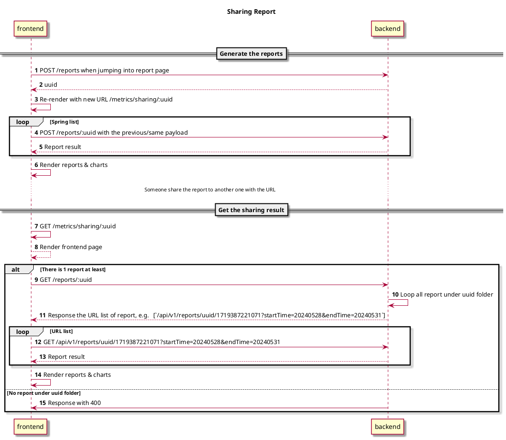

## Background

It is a bit difficult to get the final report for some users, they just want to see the report, do not want to store/upload the config file for our app. it is reasonable for the product.

Our target is to re-design the arch to match the user's requirement.

## Scopes

- Frontend
- Backend

## Design

### Frontend

|Item|New|Note|
|:--|:--|:--|
|Router|`/metrics/sharing`|for posting request to generate the reports|
|Router|`/metrics/sharing/:uuid`|for sharing|

:::note[limitations]
Define the routers ref [here](https://reactrouter.com/en/main/start/concepts#defining-routes)
:::

#### Requirement

- Add 2 routes for sharing

### Backend



#### New file/folder tree

```sh
app/output/reports
  -- uuid
    -- [startDatetime]-[endDatetime]-[timestamp].csv
````

:::note[Need actions]
- Update the logic of deleting the existing report
:::


## Decision
