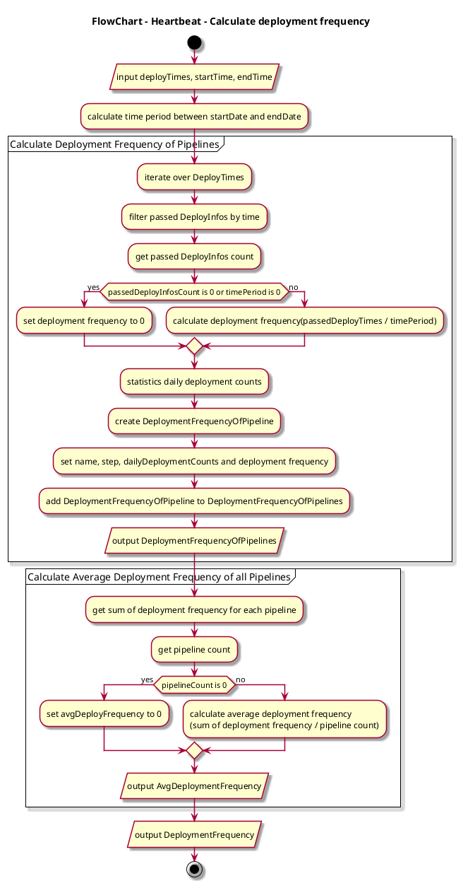
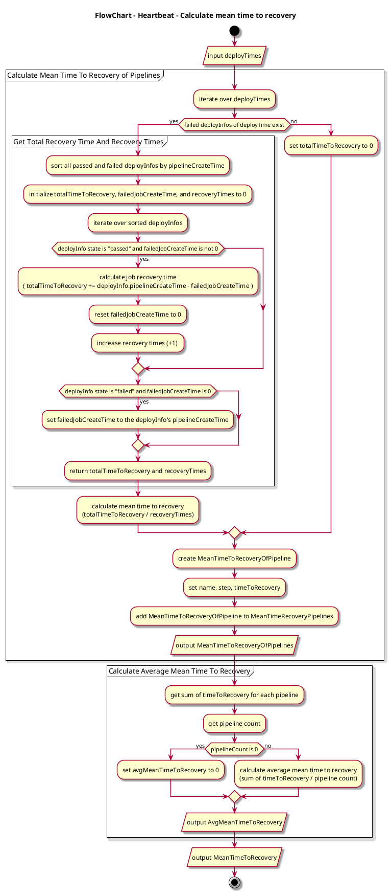

## Calculate Deployment Frequency

```plantuml
@startuml deployment frequency
skin rose
title FlowChart - Heartbeat - Calculate deployment frequency
start
:input deployTimes, startTime, endTime/
:calculate time period between startDate and endDate;
partition "Calculate Deployment Frequency of Pipelines" {
  :iterate over DeployTimes;
    :filter passed DeployInfos by time;
    :get passed DeployInfos count;
    if (passedDeployInfosCount is 0 or timePeriod is 0) then (yes)
      :set deployment frequency to 0;
    else (no)
      :calculate deployment frequency(passedDeployTimes / timePeriod);
    endif
    :statistics daily deployment counts;
    :create DeploymentFrequencyOfPipeline;
    :set name, step, dailyDeploymentCounts and deployment frequency;
    :add DeploymentFrequencyOfPipeline to DeploymentFrequencyOfPipelines;
  :output DeploymentFrequencyOfPipelines/
}
partition "Calculate Average Deployment Frequency of all Pipelines" {
  :get sum of deployment frequency for each pipeline;
  :get pipeline count;
  if (pipelineCount is 0) then (yes)
    :set avgDeployFrequency to 0;
  else (no)
    :calculate average deployment frequency
    (sum of deployment frequency / pipeline count);
  endif
  :output AvgDeploymentFrequency/
}
:output DeploymentFrequency/
stop
@enduml
```

## Calculate Mean Time To Recovery

```plantuml
@startuml mean time to recovery
skin rose
skinparam defaultTextAlignment center
title FlowChart - Heartbeat - Calculate mean time to recovery
start
:input deployTimes/
partition "Calculate Mean Time To Recovery of Pipelines" {
  :iterate over deployTimes;
    if (failed deployInfos of deployTime exist) then (yes)
      partition "Get Total Recovery Time And Recovery Times" {
        :sort all passed and failed deployInfos by pipelineCreateTime;
        :initialize totalTimeToRecovery, failedJobCreateTime, and recoveryTimes to 0;
        :iterate over sorted deployInfos;
          if (deployInfo state is "passed" and failedJobCreateTime is not 0) then (yes)
            :calculate job recovery time
            ( totalTimeToRecovery += deployInfo.pipelineCreateTime - failedJobCreateTime );
            :reset failedJobCreateTime to 0;
            :increase recovery times (+1) ;
          endif
          if (deployInfo state is "failed" and failedJobCreateTime is 0) then (yes)
            :set failedJobCreateTime to the deployInfo's pipelineCreateTime;
          endif
        :return totalTimeToRecovery and recoveryTimes;
      }
      :calculate mean time to recovery
      (totalTimeToRecovery / recoveryTimes);
    else (no)
      :set totalTimeToRecovery to 0;
    endif
  :create MeanTimeToRecoveryOfPipeline;
  :set name, step, timeToRecovery;
  :add MeanTimeToRecoveryOfPipeline to MeanTimeRecoveryPipelines;
  :output MeanTimeToRecoveryOfPipelines/
}
partition "Calculate Average Mean Time To Recovery" {
  :get sum of timeToRecovery for each pipeline;
  :get pipeline count;
  if (pipelineCount is 0) then (yes)
    :set avgMeanTimeToRecovery to 0;
  else (no)
    :calculate average mean time to recovery
    (sum of timeToRecovery / pipeline count);
  endif
  :output AvgMeanTimeToRecovery/
}
:output MeanTimeToRecovery/
stop
@enduml
```
