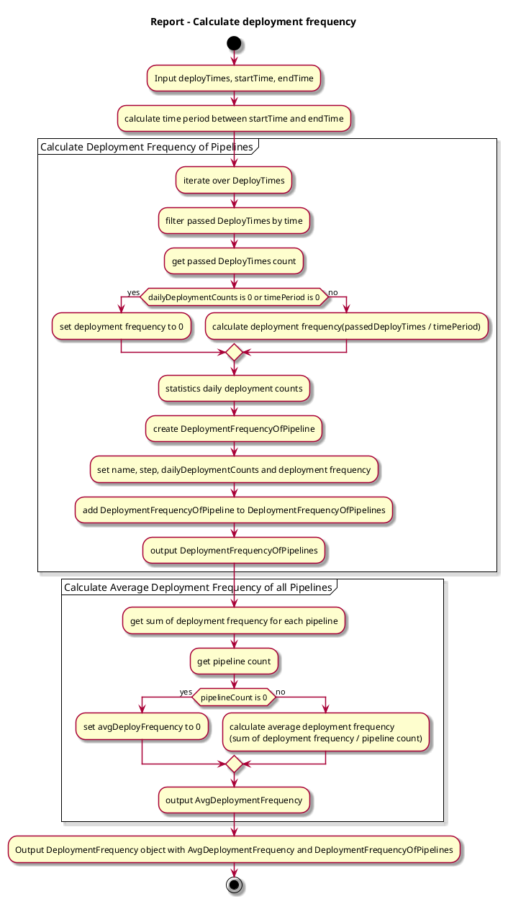

## Calculate Deployment Frequency

```plantuml
@startuml deployment frequency
skin rose
title Report - Calculate deployment frequency
start
:Input deployTimes, startTime, endTime;
:calculate time period between startTime and endTime;
partition "Calculate Deployment Frequency of Pipelines" {
  :iterate over DeployTimes;
    :filter passed DeployTimes by time;
    :get passed DeployTimes count;
    if (dailyDeploymentCounts is 0 or timePeriod is 0) then (yes)
      :set deployment frequency to 0;
    else (no)
      :calculate deployment frequency(passedDeployTimes / timePeriod);
    endif
    :statistics daily deployment counts;
    :create DeploymentFrequencyOfPipeline;
    :set name, step, dailyDeploymentCounts and deployment frequency;
    :add DeploymentFrequencyOfPipeline to DeploymentFrequencyOfPipelines;
    :output DeploymentFrequencyOfPipelines;

}
partition "Calculate Average Deployment Frequency of all Pipelines" {
  :get sum of deployment frequency for each pipeline;
  :get pipeline count;
  if (pipelineCount is 0) then (yes)
    :set avgDeployFrequency to 0;
  else (no)
    :calculate average deployment frequency
    (sum of deployment frequency / pipeline count);
  endif
  :output AvgDeploymentFrequency;
}
:Output DeploymentFrequency object with AvgDeploymentFrequency and DeploymentFrequencyOfPipelines;
stop
@enduml
```
